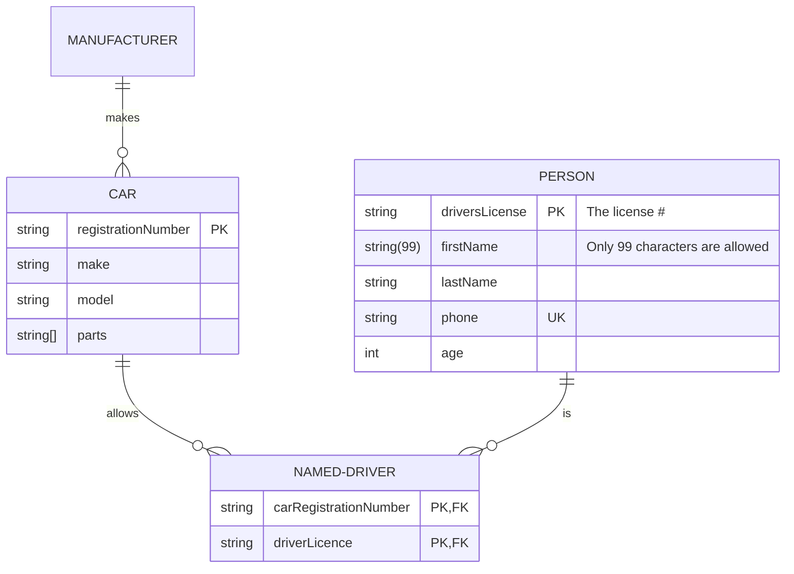

# Preface

The primary purpose of this text is to provide an open source textbook that covers
most introductory database courses. The material in the textbook was obtained from a
variety of sources. All the sources are found in at the end of each chapter. I
expect, with time, the book will grow with more information and more examples.

$$
I = \int_0^{2\pi} \sin(x)\,dx
$$

I welcome any feedback that would improve the book. If you would like to add a
section to the book, please let me know.

Adrienne Watt