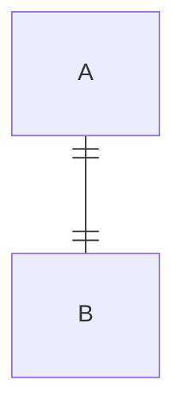
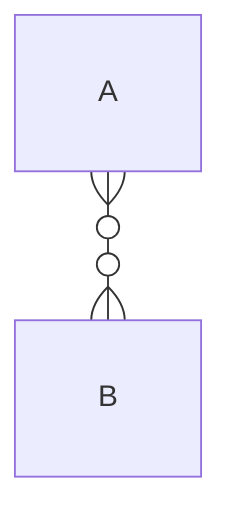
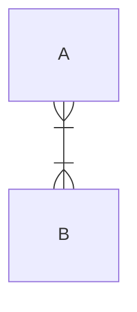
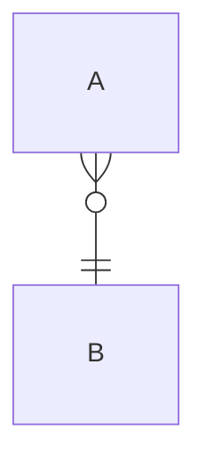
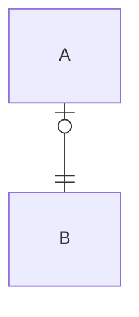
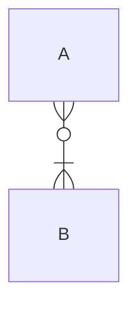

# Test

Innermost symbols on line connecting entities represents the minimum
(either zero or one).

Outermost symbols on line connecting entities represents the minimum
(either one or many).

### Cardinality: Zero or One

An occurrence of A is related to zero or one occurences of B (and vice versa).

### Cardinality: Exactly One

An occurrence of A is related to one and only one occurence of B (and vice versa).

### Cardinality: Zero or More

An occurrence of A is related to zero or more occurences of B (and vice versa).

### Cardinality: One or More

An occurrence of A is related to zero or more occurences of B (and vice versa).

### Cardinality: Other

An occurrence of A is related to exactly one occurence of B.

An occurrence of B is related to zero or more occurences of A.

